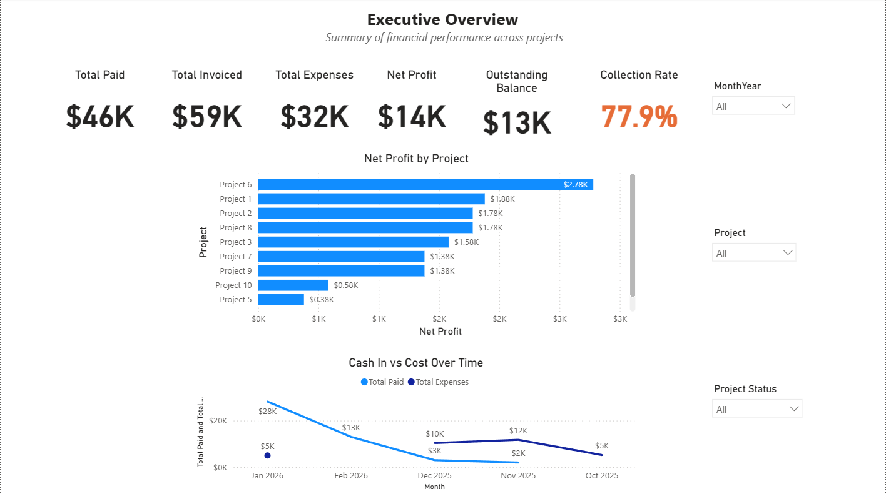
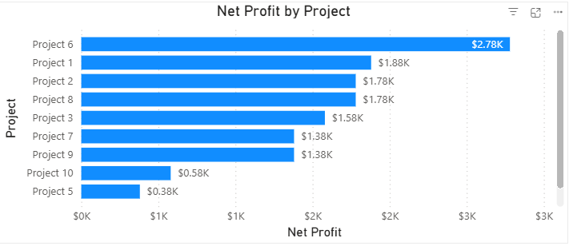
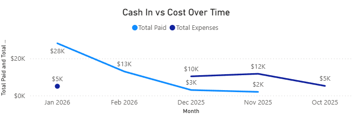

# Power BI – Project Financial Control Dashboard

## Overview
This Power BI dashboard provides an **executive-level financial overview** of multiple projects, focusing on invoicing, payments, expenses, profitability, and cash collection performance.

It is designed for:
- Project Managers
- Finance teams
- Executives needing quick financial insights

---

## Key Business Questions Answered
- How much have we **invoiced vs collected**?
- What is the **outstanding amount** across projects?
- Which projects are **most profitable**?
- How do **expenses and payments trend over time**?
- What is the **collection efficiency (%)**?

---

## Executive KPIs
- **Total Invoiced**
- **Total Paid**
- **Total Expenses**
- **Net Profit**
- **Outstanding Amount**
- **Collection Rate (%)** with conditional formatting

---

## Data Model
The model follows a **star schema** design:

- **Fact tables**
  - FactInvoices
  - FactPayments
  - FactExpenses
  - FactChangeOrders

- **Dimension tables**
  - DimProjects
  - DimDate

Surrogate keys (ProjectID, Date) are used to ensure clean relationships and scalability.

---
## Screenshots

### Executive Overview


### Net Profit by Project


### Paid vs Expenses Over Time


## Data Model

## Key DAX Measures
Some highlighted measures include:

## Design Decisions & Trade-offs

This project intentionally focuses on **analytical design, scalability, and business usability**, rather than visual complexity alone. Below are the key design decisions and the reasoning behind them.

---

### 1. Star Schema Data Model
**Decision:**  
The model was designed using a **star schema** with shared dimensions.

**Why:**  
- Improves performance and clarity
- Enables consistent slicing across all fact tables
- Reflects how enterprise BI models are built

**Implementation:**
- Fact tables: Invoices, Payments, Expenses, Change Orders
- Dimensions: Projects, Date

---

### 2. Dedicated Date Dimension (DimDate)
**Decision:**  
A centralized **DimDate** table was created instead of using date columns directly from fact tables.

**Why:**  
- Enables consistent time-based analysis
- Allows proper Month/Year sorting
- Supports future time intelligence (YoY, MoM, aging)

**Trade-off:**  
Requires additional setup, but significantly improves analytical correctness.

---

### 3. Measures vs Calculated Columns
**Decision:**  
All KPIs (Net Profit, Outstanding Amount, Collection Rate, etc.) were implemented as **DAX measures**, not calculated columns.

**Why:**  
- Measures respect filters and slicers dynamically
- Avoids data duplication
- Ensures a single source of truth for business logic

---

### 4. Dedicated Measures Table
**Decision:**  
All measures were centralized in a standalone **Measures** table.

**Why:**  
- Improves model readability
- Separates business logic from data storage
- Makes the semantic layer easier to maintain

---

### 5. Technical Keys Hidden from Report View
**Decision:**  
Surrogate keys (ProjectID, PaymentID, etc.) were hidden from the report view.

**Why:**  
- Prevents accidental misuse by report users
- Keeps the field list business-friendly
- Mirrors real-world semantic modeling practices

---

### 6. KPI-First Dashboard Design
**Decision:**  
The Executive Overview page starts with KPI cards before charts.

**Why:**  
- Executives need a fast “health check”
- KPIs answer the *what*, charts explain the *why*
- Reduces cognitive load for decision-makers

---

### 7. Conditional Formatting for Collection Rate
**Decision:**  
Collection Rate uses color-based conditional formatting.

**Why:**  
- Immediately highlights financial risk
- Enables at-a-glance interpretation
- Aligns with executive reporting expectations

---

### 8. Limited Dataset (Intentional)
**Decision:**  
The dataset is intentionally small and simulated.

**Why:**  
- The focus is on **modeling, KPI design, and analytical thinking**
- Demonstrates how the solution scales conceptually
- Reflects early-stage or pilot analytics projects in real organizations

---

### 9. PBIX File Not Publicly Shared
**Decision:**  
The `.pbix` file is not included in the public repository.

**Why:**  
- Keeps the focus on design and reasoning
- Prevents misuse or confusion without context
- Can be shared upon request during interviews

---

## Future Enhancements
- Invoice aging analysis
- Profit margin by project
- Forecast vs actual comparison
- Drill-through project detail pages
- Integration with ERP or accounting systems

```DAX
Outstanding Amount =
[Total Invoiced] - [Total Paid]
Collection Rate % =
DIVIDE([Total Paid], [Total Invoiced])

Net Profit =
[Total Invoiced] - [Total Expenses]
